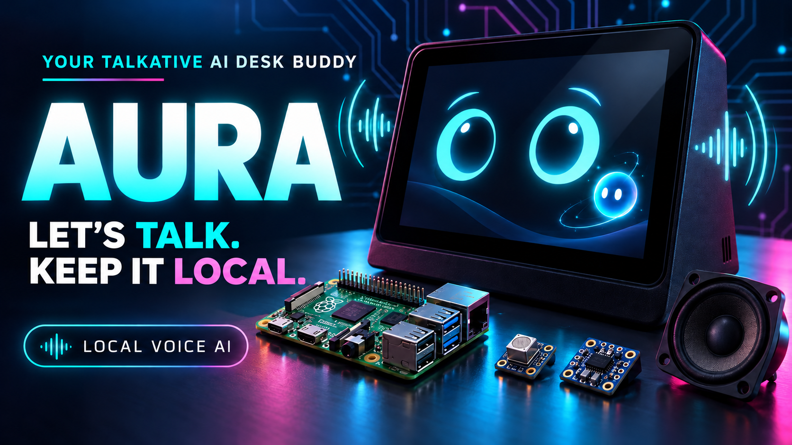
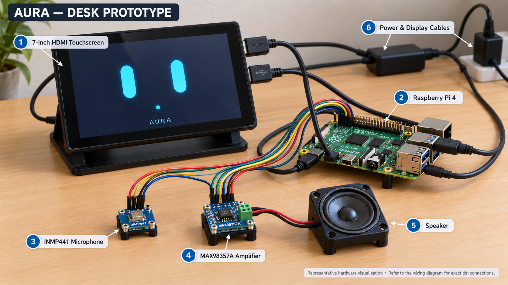
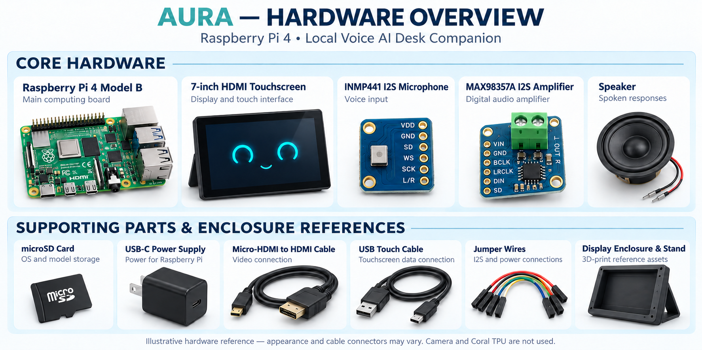
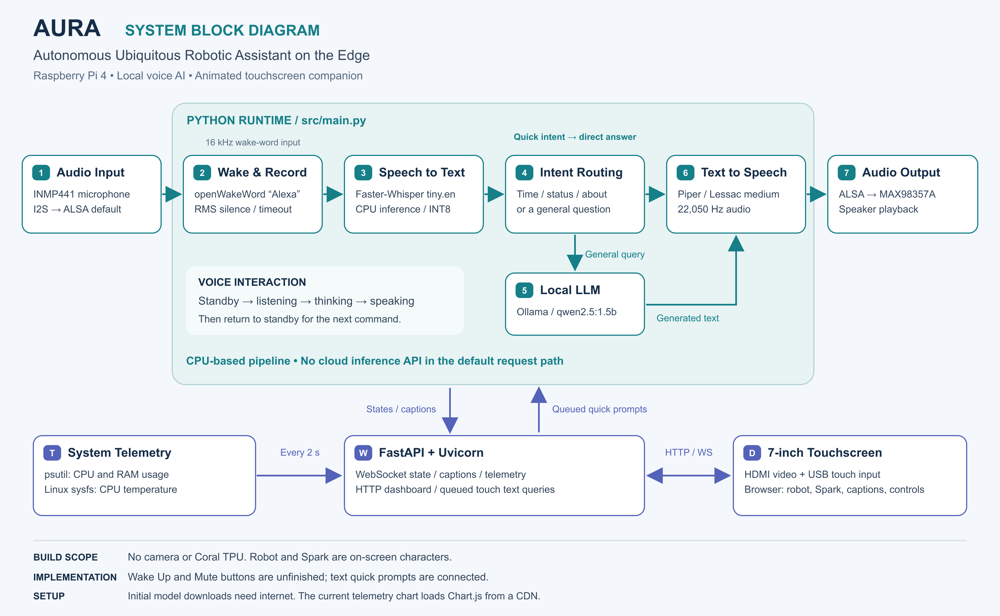
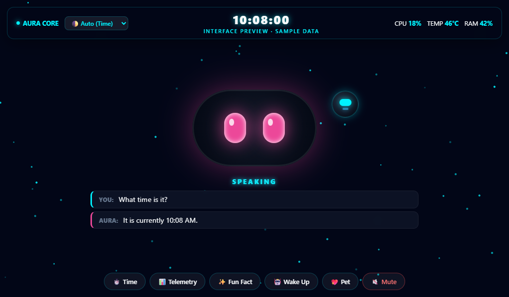
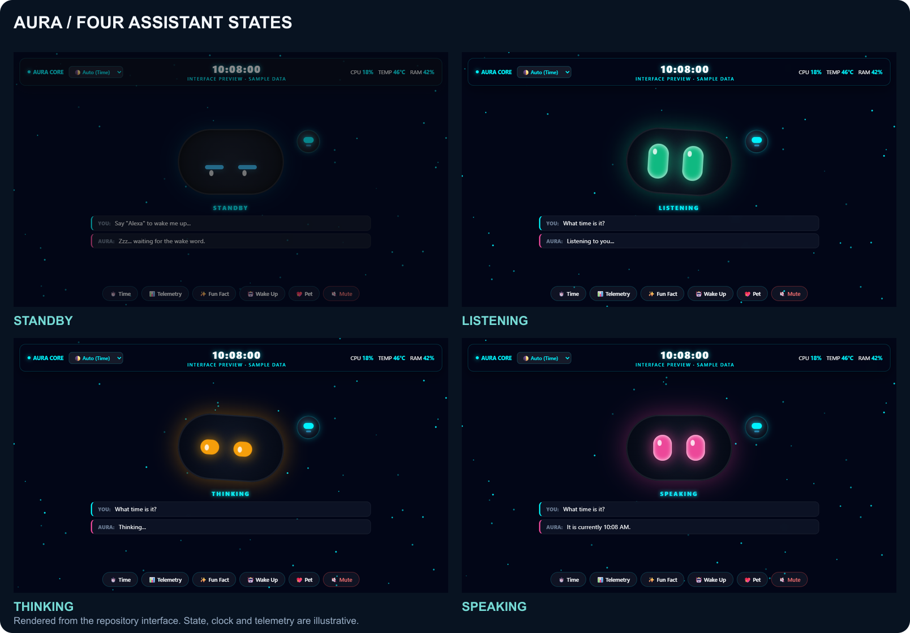
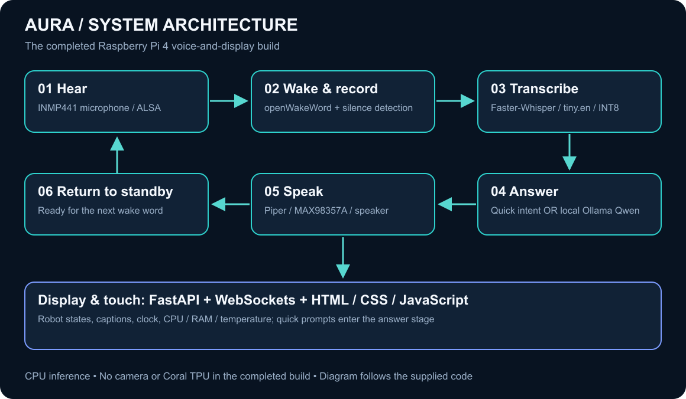
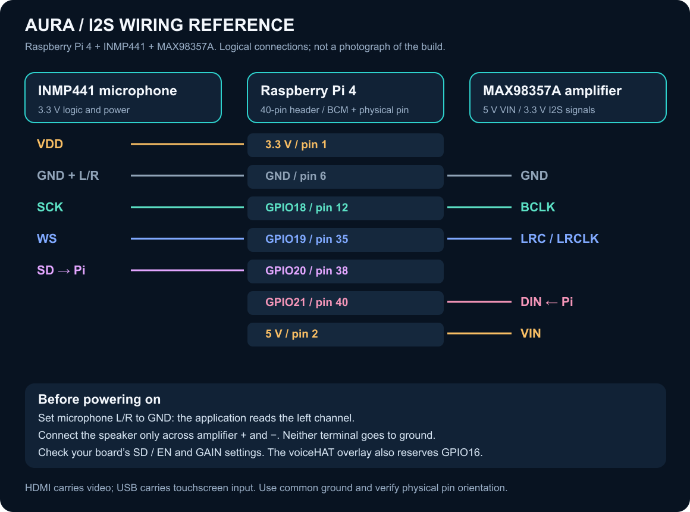

# AURA — Pi Edge Smart Display

**AURA (Autonomous Ubiquitous Robotic Assistant on the Edge)** is a Raspberry Pi 4–based AI desk companion that combines **offline wake-word detection, local speech recognition, local LLM inference, text-to-speech, an animated touchscreen interface, and live system telemetry**.

The completed build uses an **INMP441 I2S microphone**, a **MAX98357A amplifier and speaker**, and a **7-inch HDMI touchscreen**. The core voice pipeline runs on the Pi's CPU. **No camera or Google Coral TPU was used in the completed build.**

## The Problem I Set Out to Solve

I wanted a small desk assistant that could listen, answer questions, and speak through its own hardware without making a cloud speech or language-model API the central dependency. I also wanted the screen to make the assistant's behavior understandable: a user should be able to see when it is waiting, listening, thinking, or speaking.

The engineering challenge was to turn several independent AI tools into one usable Raspberry Pi device. That meant making the microphone and speaker work reliably through Linux audio, fitting the voice pipeline to limited compute resources, synchronizing the interface with the backend, and starting the system automatically after power-on.



| Problem | How AURA addresses it | Current boundary |
| --- | --- | --- |
| Dependence on remote inference services | Runs wake detection, transcription, response generation, and speech synthesis locally. | Initial downloads require internet; the current chart library is still loaded from a CDN. |
| Unclear feedback while an assistant processes a request | Shows animated states, recognized text, and response captions. | Eye movement is animation, not measured audio lip sync or camera tracking. |
| Unnecessary inference for simple requests | Answers time, system status, and capability questions directly. | General questions still depend on local LLM speed. |
| Fragile microphone and speaker access | Uses the configured ALSA default device with an I2S capture/playback path. | Driver configuration and wiring must match the actual hardware. |
| Repeating manual launch steps after every boot | Uses a background service and browser kiosk startup. | These require OS-level setup beyond cloning the repository. |
| Difficulty observing a resource-constrained device | Displays CPU usage, RAM usage, and CPU temperature. | These metrics do not replace a controlled performance benchmark. |

**The result:** a working voice-and-display prototype that brings local AI, physical audio hardware, an expressive interface, and automatic startup together on Raspberry Pi 4.



## Key Learning Points

This project brought together the following practical engineering lessons:

| Learning area | What the project demonstrates |
| --- | --- |
| Edge AI integration | Connecting openWakeWord, Faster-Whisper, Ollama, and Piper into one interaction loop. |
| Embedded Linux audio | Understanding I2S signals, ALSA routing, PortAudio device selection, sample formats, and capture/playback conflicts. |
| Hardware/software debugging | Testing the microphone, speaker, models, and backend separately before debugging the complete system. |
| State-driven interfaces | Mapping backend events to standby, listening, thinking, and speaking animations and captions. |
| Concurrency and communication | Running a web event loop alongside the voice loop and passing touch queries through a thread-safe queue. |
| Resource-aware design | Using a small speech model, INT8 computation, short responses, and deterministic quick intents. |
| Linux deployment | Managing virtual environments, import paths, user services, startup ordering, and kiosk sessions. |
| Performance measurement | Distinguishing streaming output from truly concurrent speech playback, and measured latency from expected speed. |
| Reproducibility and testing | Recognizing that model caches, OS configuration, stale tests, and dependency versions affect whether another person can reproduce a build. |
| Documentation and attribution | Describing implemented features accurately and keeping third-party code, models, and enclosure credits intact. |



## Why This Project?

AURA explores how a voice assistant can become a self-contained desk companion on affordable edge hardware. Say **“Alexa”**, wait for the acknowledgement, and ask a short question. The Pi converts the recording to text, produces an answer, speaks it, and updates the on-screen robot.

The system combines:

- 🎙️ Local wake-word detection with openWakeWord
- 🗣️ Local speech-to-text with Faster-Whisper
- 🧠 Local language-model inference with Ollama and Qwen
- 🔊 Spoken responses through Piper and a physical speaker
- 🖥️ An animated browser-based companion interface
- 📊 Live CPU, RAM, and temperature telemetry
- ⚡ Raspberry Pi 4 and I2S audio integration
- 🧪 Component tests and manual end-to-end verification steps
- 🧩 Display enclosure and mounting reference assets

The robot and Spark mini drone are **on-screen characters**. This version does not implement motors, navigation, a flying drone, or an integrated camera pipeline. Experimental vision files remain available for separate development.

No cloud inference API key is required for the core voice loop. Initial downloads and the current Chart.js CDN dependency are explained under [Offline Operation and Privacy](#offline-operation-and-privacy).



*Rendered from this repository's actual interface. Clock, captions, state, and telemetry are illustrative; this is not a photograph or a hardware benchmark.*

## Contents

- [The Problem I Set Out to Solve](#the-problem-i-set-out-to-solve)
- [Key Learning Points](#key-learning-points)
- [Why This Project?](#why-this-project)
- [Features and Implementation Status](#features-and-implementation-status)
- [System Architecture](#system-architecture)
- [Key Engineering Features](#key-engineering-features)
- [Hardware](#hardware)
- [Hardware Assembly and Wiring](#hardware-assembly-and-wiring)
- [Software Setup](#software-setup)
- [First Run and Everyday Use](#first-run-and-everyday-use)
- [Automatic Startup and Kiosk Mode](#automatic-startup-and-kiosk-mode)
- [Configuration](#configuration)
- [Repository Structure](#repository-structure)
- [API and Interface Integration](#api-and-interface-integration)
- [Verification and Tests](#verification-and-tests)
- [Results and Development History](#results-and-development-history)
- [Troubleshooting](#troubleshooting)
- [Offline Operation and Privacy](#offline-operation-and-privacy)
- [Known Limitations and Roadmap](#known-limitations-and-roadmap)
- [Engineering Skills Demonstrated](#engineering-skills-demonstrated)
- [Credits and Licensing](#credits-and-licensing)
- [References](#references)

## Features and Implementation Status

| Feature | Current implementation |
| --- | --- |
| Wake-word activation | openWakeWord listens for **Alexa** locally. This is a local wake word, not an Amazon Alexa integration. |
| Speech recognition | Faster-Whisper `tiny.en`, running on the CPU with INT8 computation. |
| Local responses | Ollama runs `qwen2.5:1.5b`; no cloud LLM API is used by the application. |
| Spoken output | Piper uses the `en_US-lessac-medium` voice through ALSA playback. |
| Quick answers | Time, system status, and capability queries can bypass the LLM. |
| Animated companion | Standby, listening, thinking, and speaking states; petting effects and a mini drone named Spark. |
| Captions | User transcript appears after recognition; assistant text updates as response chunks arrive. |
| Ambient themes | Auto, day, golden hour, night, and rain. Rain is a visual theme, not live weather. |
| Telemetry | CPU utilization, CPU temperature, and RAM utilization, with a chart panel. |
| Touch quick prompts | Time and Fun Fact buttons send text queries to the main loop. |
| Automatic startup | Demonstrated in the development build; requires OS-level service and desktop configuration. |
| Wake Up button | UI/event present; the backend wake callback is not connected in `src/main.py`. |
| Mute button | UI/endpoint present; it does **not** stop microphone capture in this version. |
| Vision / Coral TPU | Not part of the completed build. Vision code is experimental and not called by the main loop. |



*These are documentation previews of the actual interface, using illustrative state and telemetry values. Speaking-eye motion is animated, not measured audio lip sync. Gaze changes are randomized, not camera tracking.*

## System Architecture

### System Block Diagram

```text
                    COMPLETED BUILD: RASPBERRY PI 4

  INMP441 microphone
          │ I2S / ALSA capture
          ▼
  ┌─────────────────────────────────────────────────────────────┐
  │                  AURA Runtime — src/main.py                 │
  │                                                             │
  │  openWakeWord → Record until silence → Faster-Whisper        │
  │       “Alexa”          / timeout              │              │
  │                                              ▼              │
  │                                     Quick-intent check      │
  │                                       │            │        │
  │                              Time / status     Other query  │
  │                                       │            ▼        │
  │                                       │      Ollama / Qwen  │
  │                                       └─────┬──────┘        │
  │                                             ▼               │
  │                                          Piper TTS          │
  └───────────────┬─────────────────▲───────────┬────────────────┘
                  │ State/captions  │           │ ALSA playback
                  ▼                │           ▼
  ┌────────────────────────────┐   │    MAX98357A → Speaker
  │ FastAPI + WebSocket server │   │
  │       src/gui/server.py    │───┘ Queued touch queries
  └─────────────┬──────────────┘
                ▲
                │ CPU / RAM / temperature from psutil + sysfs
                │
                ↕ HTTP / WebSocket
  ┌─────────────────────────────────────────────────────────────┐
  │              7-inch HDMI touchscreen / browser               │
  │       Robot + Spark · Captions · Themes · Telemetry           │
  │             Time / Fun Fact quick-prompt buttons             │
  └─────────────────────────────────────────────────────────────┘

  Camera / Coral TPU: not used in this build or active runtime.
```

The dashboard receives state/caption broadcasts and telemetry from the server. Its quick-prompt buttons send text back through the WebSocket and into the runtime's queue. The browser is the display/control interface; speech is captured by the Pi's microphone.

### Visual Architecture Reference



### Interaction Flow

```text
STANDBY
   ├── “Alexa” → acknowledgement → RECORDING → TRANSCRIPTION ──┐
   └── Touch quick prompt ─────────────────────────────────────┤
                                                              ▼
                                                     QUICK-INTENT CHECK
                                                       │           │
                                              Direct answer    Ollama / Qwen
                                                       └─────┬─────┘
                                                             ▼
                                              RESPONSE TEXT + PIPER SPEECH
                                                             │
                                                             ▼
                                                          STANDBY
```

1. **Boot:** the application starts FastAPI, loads the wake-word and speech models, and speaks a time-appropriate greeting.
2. **Standby:** the microphone listens for “Alexa”; dashboard quick prompts are also checked.
3. **Capture:** after the wake acknowledgement, the Pi records a command. RMS-based speech/silence detection ends recording after a pause or a maximum duration.
4. **Transcribe:** Faster-Whisper converts the completed recording to text.
5. **Answer:** simple system questions receive deterministic answers; other questions go to the local Ollama model.
6. **Speak and display:** response chunks update captions; punctuation-delimited text is passed to Piper for playback.
7. **Reset:** the companion returns to standby for the next interaction.

`src/main.py` coordinates the voice loop. A background thread runs FastAPI's event loop. WebSockets carry state/caption updates to the browser, and a thread-safe queue carries touch queries back to the voice loop. Telemetry also updates periodically, every two seconds.

The implementation requests streamed LLM output, but Piper playback is blocking inside the stream-consumption loop. It is not a fully concurrent generation-and-speech pipeline, and the assistant does not support interrupting speech with a new voice command.

### Software Stack

| Layer | Technology used in this version |
| --- | --- |
| OS / audio | Raspberry Pi OS, ALSA, `googlevoicehat-soundcard` overlay |
| Application | Python 3.10, threading, asyncio, queue |
| Audio I/O | `sounddevice`, `soundfile`, NumPy, `aplay` |
| Wake word | openWakeWord with ONNX inference |
| Speech-to-text | Faster-Whisper / CTranslate2 |
| Language model | Ollama + Qwen 2.5 1.5B |
| Text-to-speech | Piper native executable + Lessac medium voice |
| Web backend | FastAPI, Uvicorn, WebSockets |
| Frontend | HTML, CSS, vanilla JavaScript, Canvas, Chart.js |
| System metrics | `psutil` and Linux thermal sysfs |

There is no React/Vue build step, Whisper.cpp process, or ROS node in the active application.

## Key Engineering Features

### 1. Local Voice Processing

Wake detection, speech recognition, response generation, and speech synthesis run through local components. The application connects these stages without a cloud speech or LLM API in the active request path.

### 2. Resource-Aware Responses

Time, status, and capability questions can be answered without the LLM. Other replies use a short generation limit and a concise system prompt. This reduces unnecessary work but does not establish a fixed response time.

### 3. Bounded Recording

RMS-based speech detection identifies when speech starts, and a silence timeout or maximum duration ends capture. This keeps each recorded request bounded rather than accumulating an unlimited microphone recording.

### 4. Streaming Text and Spoken Output

Ollama response chunks update the captions while text accumulates for Piper. Playback currently blocks the stream-consumption loop; separating generation and playback is an improvement opportunity.

### 5. A Synchronized Companion Interface

FastAPI and WebSockets connect the voice pipeline to the robot states and captions. Periodic telemetry makes the Pi's resource usage visible, while local animations provide visual personality.

### 6. Device Startup and Audio Integration

ALSA configuration connects the physical audio hardware to the application. A user service and kiosk configuration allow the assistant and display to start automatically, once the OS and models are configured.

### 7. A Physical Build with Expandable Software

The working device combines compute, microphone, amplifier, speaker, and touchscreen hardware. Enclosure assets support mechanical development. The experimental vision module is retained separately and is not presented as part of the completed build.

## Hardware

### Completed Build

| Component | Purpose | Notes |
| --- | --- | --- |
| Raspberry Pi 4 | Runs the application and local AI models | Exact RAM capacity is not recorded here. |
| 7-inch HDMI touchscreen | Companion interface and touch controls | Verify the connectors and supply requirements of your particular display. |
| INMP441 I2S microphone | Voice input | Connected as the left I2S channel. |
| MAX98357A I2S amplifier | Digital audio to speaker output | Match supply, gain, and enable settings to the breakout board. |
| Speaker | Spoken responses | Use a speaker within the amplifier board's supported impedance and power specifications. |
| microSD card | OS, application, and model storage | Allow space for the OS, Python environment, and downloaded models. |
| Pi power supply, HDMI cable, USB touch cable, jumper wires | Power and interconnection | Account for display and speaker load when powering the assembly. |
| Enclosure / stand | Mechanical mounting | Reference models are included under `hardware/3d-printed-enclosure/`. |

A camera and Coral TPU are **not required** for these instructions. Raspberry Pi 5 compatibility has not been established by this build.

## Hardware Assembly and Wiring

### 1. Connect the Display

1. With power disconnected, connect a Pi 4 micro-HDMI output to the display's HDMI input.
2. Connect the display's USB touch interface to the Pi. HDMI alone does not carry touch input.
3. Supply display power as specified by its manufacturer; USB connector roles differ between boards.
4. Keep the Pi and audio circuitry mechanically separated from exposed metal and mounting screws.

### 2. Connect the Microphone and Amplifier



This is a **reference connection map for the confirmed component types**, not a record of inspected physical wiring. BCM GPIO numbers and physical header-pin numbers are different numbering systems. Verify the board orientation before connecting power.

| Pi signal | BCM GPIO | Physical pin | INMP441 | MAX98357A |
| --- | --- | --- | --- | --- |
| 3.3 V | — | 1 | VDD / VCC | — |
| 5 V | — | 2 | **Do not connect to microphone VDD** | VIN, for a suitable 5 V breakout |
| Ground | — | 6, or another GND pin | GND and L/R | GND |
| I2S bit clock | 18 | 12 | SCK | BCLK |
| I2S word select | 19 | 35 | WS | LRC / LRCLK |
| Data into Pi | 20 | 38 | SD | — |
| Data out of Pi | 21 | 40 | — | DIN |

- Connect microphone **L/R to GND** to select the left channel. The current code takes `indata[:, 0]`; a microphone configured only for the right channel can produce apparent silence.
- The mic and amplifier share the clock lines and ground. Their data lines have different directions.
- Connect the speaker across the amplifier's speaker `+` and `−` terminals. Neither speaker terminal should be connected to Pi ground.
- Check the breakout's `SD`/`EN` and `GAIN` behavior against its own documentation. Do not confuse microphone `SD` (audio data) with amplifier `SD` (shutdown/mode).
- The `googlevoicehat-soundcard` overlay also reserves **GPIO16 / physical pin 36** for its shutdown control. Its presence in software does not prove a physical Google VoiceHAT board is fitted; this build uses the separate microphone and amplifier listed above.

Pin references: [Raspberry Pi hardware documentation](https://www.raspberrypi.com/documentation/computers/raspberry-pi.html), [INMP441 datasheet](https://invensense.tdk.com/wp-content/uploads/2015/02/INMP441.pdf), [Adafruit MAX98357A wiring](https://learn.adafruit.com/adafruit-max98357-i2s-class-d-mono-amp/raspberry-pi-wiring), and the [voiceHAT overlay source](https://github.com/raspberrypi/linux/blob/rpi-6.18.y/arch/arm/boot/dts/overlays/googlevoicehat-soundcard-overlay.dts).

### 3. Mount the Assembly

The repository includes EYEWINK and generic 7-inch HDMI display enclosure variants, a lid, stand parts, and a 3MF project. Choose a case that matches the actual screen PCB and connectors before printing. Leave room for ventilation, cables, the microphone opening, and the speaker.

The enclosure files include third-party designs. Their authors and attribution requirements are listed under [Credits and licensing](#credits-and-licensing). The repository does not establish that every included model was printed or fitted to the final device.

## Software Setup

The following commands are for **Bash on the Raspberry Pi**, including a terminal opened over SSH. They are not Windows PowerShell commands. Complete each checkpoint before enabling automatic startup.

**Reproduction status:** these instructions reconcile the source with the recorded Pi deployment. The dependency snapshot and newly supplied setup examples have not been rebuilt on a clean physical Pi as part of this documentation update.

### 1. Prepare Raspberry Pi OS

Use Raspberry Pi Imager to install **Raspberry Pi OS Desktop, 64-bit**. Configure a user account, network access, and SSH if you want to develop from a laptop. The desktop edition provides the graphical session needed for the on-device browser. Follow the [official getting-started guide](https://www.raspberrypi.com/documentation/computers/getting-started.html).

After booting, check the device and architecture:

```bash
tr -d '\0' < /proc/device-tree/model
printf '\n'
uname -m
cat /etc/os-release
```

The installation below expects `aarch64`. It uses a Python 3.10 environment to match the project and avoid relying on the OS's default Python version.

Install OS packages:

```bash
sudo apt update
sudo apt install -y git curl ca-certificates build-essential \
  alsa-utils libportaudio2 portaudio19-dev libsndfile1 \
  libgl1 libglib2.0-0 chromium
```

Package availability depends on the OS release. If `chromium` has a different package name on your image, use the Chromium package provided by that distribution.

### 2. Clone the Project

Use the directory name below to match the supplied service example:

```bash
mkdir -p ~/Desktop
cd ~/Desktop
git clone https://github.com/AnasHussaink/Autonomous-Ubiquitous-Robotic-Assistant-on-the-Edge.git Pi-Edge-Smart-Display
cd ~/Desktop/Pi-Edge-Smart-Display
```

If you already have the project there, open that existing folder instead of cloning over it.

### 3. Enable the I2S Audio Overlay

Back up and open the configuration file used by your OS:

```bash
sudo cp /boot/firmware/config.txt /boot/firmware/config.txt.aura-backup
sudo nano /boot/firmware/config.txt
```

On older images, the active file may be `/boot/config.txt`; use that path instead if appropriate. Add these lines in an applicable section, such as `[all]`, if they are not already present:

```ini
dtparam=i2s=on
dtoverlay=googlevoicehat-soundcard
```

Use one audio overlay for this configuration. Do not also add an unrelated DAC or Voice Bonnet overlay that claims the same I2S peripheral. Existing `dtparam=audio=on` controls onboard audio; it is not a substitute for the capture overlay above.

Add your user to the audio group and reboot:

```bash
sudo usermod -aG audio "$USER"
sudo reboot
```

Reconnect, then inspect the devices:

```bash
cat /proc/asound/cards
arecord -l
aplay -l
```

**Checkpoint:** a capture-capable card associated with `googlevoicehat` should be listed. The recorded build used the card identifier `sndrpigooglevoi`. Its numeric card index can change after boot, so the next configuration uses the identifier instead.

The overlay is documented in the [official Raspberry Pi overlay list](https://github.com/raspberrypi/firmware/blob/master/boot/overlays/README).

### 4. Configure ALSA Capture and Playback

Review [`docs/setup/asound.conf.example`](docs/setup/asound.conf.example). It maps the default device to the voiceHAT-compatible audio card and uses ALSA's plug conversion for capture.

If your card identifier differs from `sndrpigooglevoi`, edit both occurrences in the example before copying it. Back up existing configuration first:

```bash
cd ~/Desktop/Pi-Edge-Smart-Display
if [ -f /etc/asound.conf ]; then
  sudo cp /etc/asound.conf /etc/asound.conf.aura-backup
fi
sudo cp docs/setup/asound.conf.example /etc/asound.conf
cat /etc/asound.conf
```

An existing `~/.asoundrc` can override or conflict with the system configuration. Inspect it and reconcile the two files rather than keeping incompatible default-device definitions.

Before testing, stop any running AURA instance so it releases the microphone. If you have already configured the user service:

```bash
systemctl --user stop aura.service
```

Test recording and playback:

```bash
arecord -D default -d 3 -f S16_LE -r 48000 -c 2 /tmp/aura-mic-test.wav
aplay -D default /tmp/aura-mic-test.wav
```

Speak during the three-second recording. **Checkpoint:** you should hear the recording through the speaker. Solve audio errors here before proceeding; activating a Python environment does not fix an ALSA driver or wiring problem.

### 5. Create the Python Environment

Install `uv` using its [official installer](https://docs.astral.sh/uv/getting-started/installation/):

```bash
curl -LsSf https://astral.sh/uv/install.sh -o /tmp/aura-install-uv.sh
sh /tmp/aura-install-uv.sh
export PATH="$HOME/.local/bin:$PATH"

cd ~/Desktop/Pi-Edge-Smart-Display
uv python install 3.10
uv venv --python 3.10
source .venv/bin/activate
uv pip install -r requirements.txt
python --version
```

`requirements.txt` is the project's exported environment snapshot, including development and experimental vision packages. It is not a minimal dependency list or a cross-platform lockfile. If a pinned package cannot be resolved, record the exact error and OS/architecture; do not silently claim the installation succeeded or remove arbitrary dependencies.

Check Python's view of audio:

```bash
python -c "import sounddevice as sd; print(sd.query_devices()); print('Default:', sd.default.device)"
python -c "import sounddevice as sd; sd.check_input_settings(device=None, channels=2, samplerate=48000); print('Input settings accepted')"
```

The application's `get_i2c_mic_id()` returns `None`, selecting the ALSA default device. Despite the helper's historical name, this is **I2S** audio, not an I2C microphone.

### 6. Install Ollama and Download Qwen

Follow the [Ollama Linux installation guide](https://docs.ollama.com/linux). For its standard installer:

```bash
curl -fsSL https://ollama.com/install.sh -o /tmp/aura-install-ollama.sh
sh /tmp/aura-install-ollama.sh
sudo systemctl enable --now ollama
ollama pull qwen2.5:1.5b
ollama list
ollama run qwen2.5:1.5b "Answer in one short sentence: What is a Raspberry Pi?"
```

**Checkpoint:** the model returns a response. The active model name is hard-coded in `src/main.py`. Downloading a different model alone does not change the application. Model reference: [Qwen 2.5 1.5B in Ollama](https://ollama.com/library/qwen2.5:1.5b).

### 7. Download Wake-word and Speech-recognition Assets

Run these commands as the same user who will run AURA, with the virtual environment active:

```bash
cd ~/Desktop/Pi-Edge-Smart-Display
source .venv/bin/activate
python -c "from openwakeword.utils import download_models; download_models()"
python -c "from openwakeword.model import Model; Model(wakeword_models=['alexa'], inference_framework='onnx'); print('Wake model ready')"
python -c "from faster_whisper import WhisperModel; WhisperModel('tiny.en', device='cpu', compute_type='int8'); print('Whisper model ready')"
```

These steps need internet access the first time. The Whisper model is cached for the current user; it is not included in the ZIP. The English-only `tiny.en` configuration is the one used by the project.

References: [openWakeWord installation and models](https://github.com/dscripka/openWakeWord) and [Faster-Whisper usage](https://github.com/SYSTRAN/faster-whisper).

### 8. Install the Piper Executable and Voice

The current code expects the **legacy native Piper executable** at `~/piper/piper/piper`. These commands reproduce that path using its ARM64 release. This upstream repository is archived; the instructions intentionally match the project's executable and CLI rather than silently substituting another Piper implementation.

```bash
mkdir -p ~/piper
curl -fL https://github.com/rhasspy/piper/releases/download/2023.11.14-2/piper_linux_aarch64.tar.gz \
  -o /tmp/aura-piper-aarch64.tar.gz
tar -xzf /tmp/aura-piper-aarch64.tar.gz -C ~/piper
~/piper/piper/piper --help

cd ~/Desktop/Pi-Edge-Smart-Display
mkdir -p models/piper
curl -fL https://huggingface.co/rhasspy/piper-voices/resolve/main/en/en_US/lessac/medium/en_US-lessac-medium.onnx \
  -o models/piper/en_US-lessac-medium.onnx
curl -fL https://huggingface.co/rhasspy/piper-voices/resolve/main/en/en_US/lessac/medium/en_US-lessac-medium.onnx.json \
  -o models/piper/en_US-lessac-medium.onnx.json
```

Both the `.onnx` file and its `.onnx.json` configuration are required. Test a fixed sentence:

```bash
printf '%s\n' 'Hello. I am Aura.' | ~/piper/piper/piper \
  --model models/piper/en_US-lessac-medium.onnx \
  --output_file /tmp/aura-piper-test.wav
aplay -D default /tmp/aura-piper-test.wav
```

**Checkpoint:** the sentence is audible. The voice's sample rate is **22,050 Hz**, matching the raw playback rate in `src/main.py`. If choosing another voice, check its configuration and update the code accordingly.

References: [Piper release assets](https://github.com/rhasspy/piper/releases/tag/2023.11.14-2), [voice configuration](https://huggingface.co/rhasspy/piper-voices/blob/main/en/en_US/lessac/medium/en_US-lessac-medium.onnx.json), and [voice model card](https://huggingface.co/rhasspy/piper-voices/blob/main/en/en_US/lessac/medium/MODEL_CARD).

## First Run and Everyday Use

### Start Manually

From the project root:

```bash
cd ~/Desktop/Pi-Edge-Smart-Display
source .venv/bin/activate
python -m src.main
```

Module execution keeps the repository root on Python's import path. The equivalent direct-script command is `PYTHONPATH=. python src/main.py`.

The application should announce its startup, load its models, speak a greeting, and enter standby. Open:

- On the Pi: **http://localhost:8000**
- On a laptop on the same trusted LAN: **http://PI_IP:8000**, replacing `PI_IP` with the Pi's address from `hostname -I`.

`localhost` on a laptop means the laptop, not the Pi. The laptop browser displays the Pi's dashboard; it does not send its microphone audio to the Pi.

### Ask a Question

1. Say **“Alexa.”**
2. Wait for the acknowledgement and listening state.
3. Ask a short question, such as “What time is it?” or “Tell me a fun fact.”
4. Pause briefly to finish the recording.
5. Read the captions and listen to the reply.

No-speech and empty-transcript cases return to standby. The acknowledgement uses `sounds/yes.wav` if available; that optional file is absent from the supplied snapshot, so Piper says “Yes?” instead.

| Control | What it does |
| --- | --- |
| Time | Sends a quick text query; the Pi answers using its clock. |
| Fun Fact | Sends a text query to the local LLM. |
| Telemetry | Opens the CPU / temperature / RAM chart. |
| Theme selector | Chooses auto, day, golden hour, night, or rain ambience. |
| Pet / robot tap / Spark tap | Plays visual interactions and updates the caption. |
| Wake Up | Changes the UI and sends a wake event; voice recording is not triggered by this button yet. |
| Mute | Changes the UI and calls a placeholder endpoint; it is not an operational microphone mute. |

Press **Ctrl+C** in the foreground terminal to stop the application. The normal keyboard-interrupt path attempts a spoken farewell.

## Automatic Startup and Kiosk Mode

Enable these only after the manual voice pipeline works. The background assistant and the on-screen browser are separate startup tasks.

### 1. Install the User Service

The documentation includes [`aura.service`](docs/setup/aura.service) and a [reference launcher](docs/setup/start-aura.sh). The launcher finds the repository relative to itself, checks Ollama and default audio readiness, then runs the application's module. These are new deployment examples; they do not overwrite the original `start_aura.sh`.

The service expects `~/Desktop/Pi-Edge-Smart-Display`. Adjust both paths in it if your checkout is elsewhere.

```bash
cd ~/Desktop/Pi-Edge-Smart-Display
mkdir -p ~/.config/systemd/user
cp docs/setup/aura.service ~/.config/systemd/user/aura.service
systemctl --user daemon-reload
sudo loginctl enable-linger "$USER"
sudo systemctl enable --now ollama
systemctl --user enable --now aura.service
systemctl --user status aura.service --no-pager
journalctl --user-unit=aura.service -n 60 --no-pager
```

If a system-wide `aura.service` already exists from an earlier attempt, stop/disable that older instance before enabling the user service. Do not run the same assistant in a terminal and a service simultaneously: both will compete for port 8000 and the microphone.

Useful commands:

```bash
systemctl --user restart aura.service
systemctl --user stop aura.service
journalctl --user-unit=aura.service -f
```

### 2. Open the Dashboard Automatically

Enable **desktop autologin** for the display account using Raspberry Pi OS configuration if a fully hands-free boot is required. User-service lingering starts the backend without a login; it does not create a graphical desktop session.

The included [`start-kiosk.sh`](docs/setup/start-kiosk.sh) waits for the web server, then launches Chromium. Use one of the following autostart methods, not both.

**Desktop autostart entry** — create a launcher for desktops that honor XDG autostart:

```bash
mkdir -p ~/.config/autostart
cat > ~/.config/autostart/aura-kiosk.desktop <<EOF
[Desktop Entry]
Type=Application
Name=AURA Kiosk
Exec=/bin/bash "$HOME/Desktop/Pi-Edge-Smart-Display/docs/setup/start-kiosk.sh"
Terminal=false
X-GNOME-Autostart-enabled=true
EOF
```

**Labwc session** — if your Pi uses Labwc and the desktop entry is not launched, add the following line to the existing `~/.config/labwc/autostart`, preserving its other contents:

```bash
/bin/bash "$HOME/Desktop/Pi-Edge-Smart-Display/docs/setup/start-kiosk.sh" &
```

Follow the [official Raspberry Pi kiosk guide](https://www.raspberrypi.com/tutorials/how-to-use-a-raspberry-pi-in-kiosk-mode/) for the compositor used by your OS. Disable screen blanking in OS settings if you want the companion continuously visible. The interface's standby dimming is a CSS effect, not physical backlight control.

### 3. Verify a Full Reboot

```bash
sudo reboot
```

Check that the dashboard appears, the greeting is spoken, “Alexa” activates listening, and a response returns the companion to standby. Startup duration depends on model caches, storage, CPU load, and the OS session; no fixed boot-time guarantee is made.

## Configuration

Most settings are currently Python constants, not environment variables or a settings file.

| Setting | Current value | Location / effect |
| --- | --- | --- |
| Wake word | `alexa` | `src/main.py`; requires a matching openWakeWord model |
| Wake confidence threshold | `0.5` | `WAKE_THRESHOLD` |
| Capture input | Default ALSA device, stereo, 48,000 Hz | `get_i2c_mic_id()` and input streams |
| Selected mic channel | First / left | `indata[:, 0]` |
| Wake-word audio | 16 kHz, int16 | Every third sample from the 48 kHz input; simple decimation |
| Silence timeout | `0.9` seconds | `SILENCE_DURATION` after speech starts |
| Recording limit | `8.0` seconds | `MAX_RECORD_TIME` |
| Speech RMS threshold | `0.004` | `SPEECH_RMS_THRESHOLD`; room-dependent |
| STT | `tiny.en`, CPU, INT8 | `WhisperModel(...)` in `main()` |
| LLM | `qwen2.5:1.5b` | `ollama.chat(...)` in `src/main.py` |
| Generation options | `num_predict=35`, `temperature=0.2` | Short responses; not a speed guarantee |
| Piper executable | `~/piper/piper/piper` | `PIPER_BIN` |
| Piper voice | `models/piper/en_US-lessac-medium.onnx` | `PIPER_MODEL` |
| Audio output | `default`, raw 22,050 Hz signed 16-bit | `AUDIO_OUTPUT` / `speak_response()` |
| HTTP / WebSocket server | `0.0.0.0:8000` | `start_gui_server()` |
| Periodic telemetry | Every `2.0` seconds | `src/gui/server.py` |

The LLM receives a system message and the current query; previous turns are not supplied as conversational memory. The one-sentence/under-14-words instruction is a prompt preference, not a strict output validator.

The active page is [`src/gui/templates/index.html`](src/gui/templates/index.html), with embedded CSS and JavaScript. The separate files under `src/gui/static/` are retained but are not loaded by this HTML snapshot. Edit the inline blocks to change the active interface, or deliberately refactor the page to load the external files.

## Repository Structure

```text
.
├── README.md
├── LICENSE
├── requirements.txt                 # Exported environment snapshot
├── pytest.ini
├── start_aura.sh                    # Original launcher, with deployment-specific paths
├── src/
│   ├── main.py                     # Active voice pipeline and server orchestration
│   ├── audio/audio_to_text.py      # Default audio helper and STT wrapper
│   ├── llm/llm_node.py             # Standalone Ollama helper; not the main loop's chat path
│   ├── vision/camera.py            # Experimental capture / face detection
│   └── gui/
│       ├── server.py               # HTTP, WebSocket, telemetry, callbacks
│       ├── templates/index.html    # Active self-contained companion interface
│       └── static/                 # Retained CSS and JS versions
├── tests/                          # Some tests reference older interfaces
├── audio_files/                    # Sample audio / runtime recordings
├── images/                         # Earlier capture and face-test assets
├── models/                         # Local model assets; mostly excluded by .gitignore
├── hardware/3d-printed-enclosure/   # Enclosure references and CAD/print files
└── docs/
    ├── images/                     # README previews and diagrams
    ├── setup/                      # Reference ALSA, service, and launcher files
    ├── ASSETS.md                   # Image provenance
    └── PUBLISHING.md               # Uploading this documentation package
```

The Pi's boot configuration, installed services, user desktop settings, Ollama storage, and cached models live outside the application repository. A Git clone alone does not recreate those OS-level settings. `.gitignore` also does not remove files that were already tracked; some older audio and model assets remain in the supplied snapshot.

## API and Interface Integration

| Route | Purpose |
| --- | --- |
| `GET /` | Serves the companion HTML |
| `GET /api/vitals` | Returns CPU temperature, CPU percentage, and RAM percentage |
| `WS /ws` | Sends initialization, state, and telemetry events; receives UI actions |
| `POST /api/touch-trigger` | Calls an optional wake callback; currently unbound in the main application |
| `POST /api/mute` | Placeholder response only |
| `/static/…` | Serves static files, although the current HTML embeds its own CSS/JS |

Example browser-to-server quick prompt:

```json
{"action": "query", "text": "What time is it?"}
```

Illustrative state message:

```json
{
  "type": "state_update",
  "state": "SPEAKING",
  "user_text": "What time is it?",
  "assistant_text": "It is currently 10:08 AM.",
  "cpu_temp": 46.0,
  "cpu_percent": 18.0,
  "ram_percent": 42.0
}
```

The browser reconnects after a dropped WebSocket connection. Quick prompts require an active connection and are processed when the main loop returns to its input-waiting stage.

## Verification and Tests

### Manual Acceptance Checklist

- [ ] ALSA can record and play a short microphone sample.
- [ ] The Python environment accepts stereo capture at 48 kHz.
- [ ] Ollama answers using `qwen2.5:1.5b`.
- [ ] Piper speaks the fixed test sentence.
- [ ] AURA speaks its startup greeting.
- [ ] “Alexa” triggers command recording.
- [ ] A spoken command produces a transcript and reply.
- [ ] The interface reflects listening, thinking, speaking, and standby.
- [ ] Time / Fun Fact quick prompts reach the backend.
- [ ] CPU, temperature, and RAM values update.
- [ ] A clean reboot starts the backend and display as configured.

### Existing Automated Tests

The test suite is incomplete and should not be represented as fully passing. Audio tests import `record_and_save` and `transcribe_audio`, which are absent from the current audio module. Some hardware tests also lack the `integration` marker, so `pytest -m "not integration"` is not a reliable hardware-free full-suite command.

The LLM helper's isolated tests can be targeted separately:

```bash
python -m pytest tests/llm_node_test.py -m "not integration"
```

To exercise that helper against the actual local Ollama service and downloaded model:

```bash
python -m pytest tests/llm_node_test.py -m integration
```

These helper tests do not establish end-to-end correctness of `src/main.py`. Vision tests are experimental and are not required for the completed camera-free build.

If unrelated ROS pytest plugins interfere in a development shell, isolate that test invocation:

```bash
PYTHONPATH="" PYTEST_DISABLE_PLUGIN_AUTOLOAD=1 python -m pytest tests/llm_node_test.py -m "not integration"
```

## Results and Development History

Development records from September 2026 show the project progressing from audio/service debugging to a working voice-and-display prototype:

| Stage | Recorded outcome |
| --- | --- |
| Audio integration | Resolved the deployment sufficiently to run microphone capture and speaker playback through the default ALSA path. |
| Wake detection | Logs show “Alexa” detections, including a score of `0.98`. This is an individual detection score, not a measured accuracy rate. |
| Speech recognition | Logs show a 2.75-second recording entering transcription and producing text. |
| Local response | Logs show a successful request to the local Ollama chat endpoint. |
| Spoken response | Piper synthesis/playback-related logs are followed by a return to standby. |
| Boot behavior | Automatic startup of the assistant and dashboard was reported working. |
| Interface evolution | Multiple visual prototypes led to the robot-and-Spark interface supplied here. |
| Publication | Development records show a successful GitHub push to `main`. |

An earlier logged interaction took about **3.1 seconds** from audio-processing log to recognized text, and roughly **34.5 seconds** from “Processing response” to the logged Ollama HTTP response. Those timestamps are diagnostic observations, not controlled inference benchmarks or final-version speed claims. A later final latency benchmark is not available.

The main result is **integration of local voice AI, physical audio hardware, persistent startup, and a synchronized animated interface on Raspberry Pi 4**.

## Troubleshooting

| Symptom | Checks / next step |
| --- | --- |
| `ModuleNotFoundError: uvicorn` | Activate `.venv`; confirm dependency installation completed. |
| `ModuleNotFoundError: src` | Run `python -m src.main` from the repository root. |
| Missing `server_loop` or `telemetry_loop` import | Use matching `main.py` and `server.py` versions from the same checkout. |
| `Error querying device -1` / no input device | Check overlay, `arecord -l`, ALSA defaults, and audio-group membership before changing Python indices. |
| `No input device matching 'hw:…'` | PortAudio device identifiers and raw ALSA PCM names are not interchangeable. This version uses the configured default device. |
| ALSA `Invalid argument` | Inspect the driver/card, capture support, and conflicting `.asoundrc` definitions. The message alone does not identify one proven cause. |
| `Device or resource busy` | Stop competing assistant/test processes; inspect device owners with `sudo fuser -v /dev/snd/*`. |
| Microphone records silence | Check 3.3 V supply, common ground, data pin, and L/R selection; the program reads the left channel. |
| `Piper TTS assets missing` | Verify the executable path and voice file; also keep the matching `.onnx.json` beside the model. |
| Ollama model not found | Run `ollama list`, pull the exact configured model, and verify the Ollama service. |
| Port 8000 already in use | Inspect `ss -ltnp 'sport = :8000'`; stop the identified duplicate instance instead of starting another one. |
| Page loads but does not follow speech | Confirm the browser's `/ws` connection and that the backend is the same process handling audio. |
| Editing CSS/JS changes nothing | The active HTML embeds CSS/JS. Edit that page and hard-refresh the browser. |
| Telemetry chart unavailable offline | Chart.js is currently fetched from a CDN. Serve a local copy for a fully offline dashboard. |
| Slow answers | Measure cold/warm latency, CPU temperature/load, and response length. A short token limit does not guarantee a fixed response time. |
| Empty `journalctl --user` output | Try `journalctl --user-unit=aura.service`; verify which service scope is actually running. |
| Kiosk does not appear | Check desktop autologin, the active compositor's autostart method, Chromium availability, and whether port 8000 is ready. |

Useful diagnostics:

```bash
cat /proc/asound/cards
arecord -l
aplay -l
systemctl status ollama --no-pager
systemctl --user status aura.service --no-pager
journalctl --user-unit=aura.service -n 80 --no-pager
curl -fsS http://127.0.0.1:11434/api/tags
curl -fsS http://127.0.0.1:8000/api/vitals
```

## Offline Operation and Privacy

Speech recognition, language-model inference, and speech synthesis are configured to run locally. However, **“local AI” is not the same as “zero network activity in every configuration.”**

- Installers and first-time model downloads require internet access.
- Faster-Whisper may check the model hub when resolving a model name; the development logs contain such startup requests.
- The dashboard currently imports Chart.js from `cdn.jsdelivr.net`. The telemetry chart needs that asset available or cached.
- The web server binds to all interfaces and has no application authentication. Use it on a trusted local network; do not expose port 8000 directly to the internet.
- Captured commands are written to `audio_files/live_input.wav`, overwriting that file on subsequent recordings. The most recent recording can remain on disk.
- Transcribed queries are logged, so systemd journals may contain spoken content. Captions are sent to connected dashboard clients.
- `speak_response()` currently interpolates model text into a shell command using `os.system`. Its quote removal is not complete shell escaping. Replace it with subprocess argument lists and stdin before supporting untrusted users or public access.

To verify a fully disconnected deployment, preload all models, serve Chart.js locally, prevent remote model resolution where appropriate, then test after disconnecting internet access. Such a clean offline test has not been recorded for this snapshot.

## Known Limitations and Roadmap

- [ ] Connect the Wake Up button to the microphone-recording path.
- [ ] Implement a real microphone mute with an accurate UI indicator.
- [ ] Replace shell-based TTS invocation with safe subprocess handling.
- [ ] Serve chart assets locally and validate a fully offline cold start.
- [ ] Repair stale tests and add coverage for the active orchestration path.
- [ ] Publish reproducible OS, dependency, hardware, and latency measurements.
- [ ] Separate generation and playback for smoother streaming; evaluate interruption support.
- [ ] Consolidate duplicated inline and external frontend code.
- [ ] Improve audio resampling and tune speech detection for different rooms.
- [ ] Improve runtime recovery from model, audio-device, and server failures.
- [ ] Evaluate optional vision integration separately; it is not a completed feature.

## Engineering Skills Demonstrated

**Edge AI · Embedded Linux · Python · FastAPI · WebSockets · Asyncio · Speech Recognition · Local LLM Integration · Text-to-Speech · ONNX Inference · I2S Audio · ALSA · Raspberry Pi 4 · Hardware Integration · Systemd · Browser Interfaces · Debugging · Git/GitHub · Technical Documentation**

The repository also contains experimental OpenCV/TFLite work and third-party enclosure references. These are separate from the camera-free completed build and are not evidence of a deployed vision or TPU pipeline.

## Credits and Licensing

The repository's software is supplied under its existing [MIT license](LICENSE). The existing copyright notice names **Muhammad Haris Mujeeb** and must be preserved. Repository publication and integration history do not replace existing attribution.

Third-party components and model weights have their own terms:

- [openWakeWord](https://github.com/dscripka/openWakeWord): code is Apache-2.0; the upstream included pretrained wake-word models are **CC BY-NC-SA 4.0**. The project's MIT license does not override those model restrictions.
- [Faster-Whisper](https://github.com/SYSTRAN/faster-whisper), [Ollama](https://github.com/ollama/ollama), [Qwen 2.5](https://ollama.com/library/qwen2.5:1.5b), [Piper](https://github.com/rhasspy/piper), and [Chart.js](https://www.chartjs.org/): see the respective repositories and model licenses.
- The [Lessac medium voice model card](https://huggingface.co/rhasspy/piper-voices/blob/main/en/en_US/lessac/medium/MODEL_CARD) links its dataset and licensing information.
- **EYEWINK 7-inch HDMI Display-C Case**, by **ywabiko**: [original model](https://www.printables.com/model/85018-eyewink-7-hdmi-display-c-case).
- **Generic Aliexpress 7-inch HDMI Display-C Case (Remix)**, by **Morris Lazootin**: [remix source](https://www.printables.com/model/1295933-generic-aliexpress-7-hdmi-display-c-case-remix). The bundled source PDFs identify these case designs as **CC BY 4.0**; retain their attribution when sharing/remixing them.

Documentation image provenance is recorded in [`docs/ASSETS.md`](docs/ASSETS.md). The README diagrams are explanatory assets; they are not photographs of the completed physical assembly.

## References

- [Raspberry Pi setup](https://www.raspberrypi.com/documentation/computers/getting-started.html), [GPIO hardware reference](https://www.raspberrypi.com/documentation/computers/raspberry-pi.html), and [kiosk guide](https://www.raspberrypi.com/tutorials/how-to-use-a-raspberry-pi-in-kiosk-mode/)
- [INMP441 datasheet](https://invensense.tdk.com/wp-content/uploads/2015/02/INMP441.pdf) and [MAX98357A wiring guide](https://learn.adafruit.com/adafruit-max98357-i2s-class-d-mono-amp/raspberry-pi-wiring)
- [Raspberry Pi overlay definitions](https://github.com/raspberrypi/firmware/blob/master/boot/overlays/README)
- [uv installation](https://docs.astral.sh/uv/getting-started/installation/) and [Ollama Linux installation](https://docs.ollama.com/linux)
- [openWakeWord](https://github.com/dscripka/openWakeWord), [Faster-Whisper](https://github.com/SYSTRAN/faster-whisper), and [Piper releases](https://github.com/rhasspy/piper/releases)

For bugs and reproducibility reports, include the Pi model, RAM, OS/architecture, relevant package/model versions, and the exact failing step in a [GitHub issue](https://github.com/AnasHussaink/Autonomous-Ubiquitous-Robotic-Assistant-on-the-Edge/issues).
